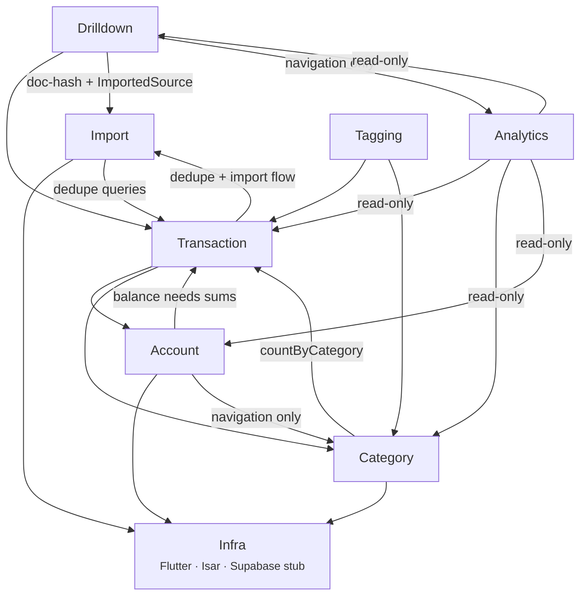

# Domain Dependencies

The diagram carries two edges the previous arrow list left out although the notes
below already described them: `Account → Category` and `Transaction → Import`.

## Intentional cycles

Two cycles exist on purpose and both are narrow. Neither is a boundary violation, and
neither may be widened without a new decision record.

| Cycle | What crosses it | What must not |
|-------|-----------------|---------------|
| Account ↔ Transaction | `LocalBalanceService` (account/data) injects `TransactionRepository` for `sumForAccount`; transactions reference accounts by `accountUuid` | Any other account code depending on the transaction feature |
| Category ↔ Transaction | `CategoryRepository` injects `TransactionRepository` for `countByCategory` only, so `delete` can refuse to archive a category still in use | Anything else in the category feature touching transactions |

## Notes
- Category assignment is on Transaction (1 category per entry, tree-aware).
- Account's dependency on Category is navigation only: `AccountListScreen`'s app bar opens `CategoryTreeScreen`. No account data or logic touches the category feature.
- `Import` holds what every import path shares: `ImportedSource`, the document hash and `DuplicateChecker`. Format-specific code stays in its own feature — the ING parser and PDF flow remain under `Transaction`. `Transaction → Import` for the dedupe checks and the import flow; `Drilldown → Import` since the photo scan (016) writes its own `ImportedSource` row. Never the reverse.
- Category → Transaction is a second intentional narrow cycle (alongside Account ↔ Transaction): `CategoryRepository` injects `TransactionRepository` solely for `countByCategory`, so `delete` can refuse to archive a category still in use. Nothing else in the category feature touches transactions.
- Drilldown line-items override parent Transaction category (fractal rule).
- Tagging learns from user-assigned Transaction↔Category pairs. `TaggingLearnService` reads a `Transaction`, so the edge points Tagging → Transaction; the learn call itself sits in the UI, never in `TransactionRepository`, which keeps it that way. Tagging holds no reference to Category beyond storing its uuid — a rule pointing at an archived category is a legal, unvalidated state.
- `Drilldown → Analytics` is navigation only, like `Account → Category`: a
  long-press on a position row pushes `ItemPriceChartScreen`. No drilldown data
  or logic touches the analytics feature, and analytics still reads drilldown —
  the pair is a screen link, not a data cycle.
- Analytics reads Transaction + Drilldown for the counting units, Category for the rollup tree, and Account for the all-accounts loop (`AccountRepository.findAll()`). All four edges are read-only — Analytics owns no entity and writes nothing.
